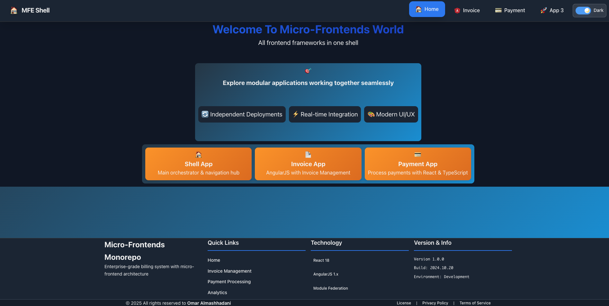

# Micro-Frontends Monorepo

A comprehensive micro-frontend architecture demonstrating enterprise-grade billing system with realistic financial domain complexity.

## 🎨 Application Screenshots
********************************************************************************

### Shell Application - Home Page
Welcome page showcasing all micro-frontends in a unified shell with seamless navigation:

![Shell App Home]

*Features: Unified navigation hub, modular application grid, real-time theme switching, and seamless micro-frontend orchestration*

---

### Invoice Management MFE
AngularJS invoice management system integrated via Module Federation with advanced React table component:

![Invoice Management]https://github.com/omarome/micro-frontends-monorepo/apps/shell_app/src/assets/invoice_app.jpeg

*Features: Advanced Material React Table, status filtering, real-time search, invoice statistics, and responsive design*

---

### Payment Processing MFE
Modern React payment form with invoice selection and secure payment processing:

![Payment Processing] https://github.com/omarome/micro-frontends-monorepo/apps/shell_app/src/assets/payment_app.jpeg
![Payment Processing] https://github.com/omarome/micro-frontends-monorepo/apps/shell_app/src/assets/light_mode.jpeg 

*Features: Invoice selector with auto-refresh, card validation, mock payment processing, and responsive form design*

---

## Architecture

This monorepo contains multiple micro-frontends orchestrated by a shell application:

- **Shell App** (Port 3000) - React 18 shell with navigation and orchestration
- **Invoice App** (Port 3001) - **UPDATED**: AngularJS 1.x invoice management with React wrapper
- **Payment App** (Port 3002) - React + TypeScript payment processing  
- **App3** (Port 3003) - React + TypeScript analytics and planning

### Integration Methods

| App | Integration Method | Status |
|-----|-------------------|--------|
| Shell | Host Application | ✅ Active |
| Invoice App | **Module Federation** | ✅ **Recently Migrated** |
| Payment App | Module Federation | ✅ Active |
| App3 | Module Federation | ✅ Active |

**Note**: The Invoice App was successfully migrated from iframe to Module Federation for better performance and integration.

## ✨ Key Features

### 🏠 **Unified Shell Application**
- **Seamless Navigation**: Tab-based routing between micro-frontends
- **Theme Management**: Dark/Light mode with real-time synchronization across all MFEs
- **Responsive Design**: Mobile-first approach with optimized layouts
- **Modern UI**: Gradient backgrounds, smooth transitions, and polished animations

### 📄 **Invoice Management MFE**
- **Advanced React Table**: Material React Table integrated in AngularJS app via Module Federation
- **Real-time Filtering**: Search by invoice number, client name, or filter by status
- **Invoice Statistics**: Live dashboard showing total, paid, unpaid, overdue counts and amounts
- **Action Buttons**: View invoice details and mark invoices as paid
- **Responsive Mobile**: Optimized table view for all screen sizes

### 💳 **Payment Processing MFE**
- **Invoice Selector**: Dynamic dropdown with auto-refresh after payment
- **Form Validation**: Real-time validation for card details and expiry date
- **Invoice Details**: Shows selected invoice information (client, amount, due date)
- **Mock Payments**: Simulates payment processing with success/error handling
- **Cross-MFE Events**: Emits payment events to update invoice status across apps

### 🎯 **Cross-Cutting Features**
- **Module Federation**: Zero-reload micro-frontend integration
- **Shared State**: Theme and payment events synchronized across all apps
- **Error Boundaries**: Graceful fallback when remote MFEs are unavailable
- **Independent Deployment**: Each MFE can be deployed and updated separately
- **Framework Agnostic**: React 18 and AngularJS 1.x working together seamlessly

## Tech Stack

- **Frontend**: React 18, AngularJS 1.x, TypeScript
- **Styling**: Tailwind CSS + Custom CSS Variables (shared across all apps)
- **Build**: Webpack 5 with Module Federation
- **Package Manager**: pnpm with workspace support
- **Development**: Hot Module Replacement, Live Reloading
- **State Management**: Event-driven communication via Custom Events

## Getting Started

### Prerequisites

- Node.js 18+
- pnpm

### Installation

```bash
# Install all dependencies
pnpm install

# Start all micro-frontends
pnpm start
```

### Quick Start (Recommended)

```bash
# 1. Start all apps in development mode
pnpm start

# 2. Access the applications
# Shell App: http://localhost:3000
# Invoice App: http://localhost:3001 (Module Federation)
# Payment App: http://localhost:3002
# App3: http://localhost:3003
```

**Note**: The Invoice App now runs as a Module Federation remote, not as a standalone iframe application.

### Individual App Development

```bash
# Shell App (Port 3000)
cd apps/shell_app && pnpm start

# Invoice App (Port 3001) 
cd apps/invoice_app && pnpm start

# Payment App (Port 3002)
cd apps/payment_app && pnpm start

# App3 (Port 3003)
cd apps/app3 && pnpm start
```

## Tailwind CSS

All applications use Tailwind CSS for consistent styling:

- **Shared Configuration**: `tailwind.config.js` at root level
- **Shared Styles**: `libs/ui-styles/src/shared-styles.css`
- **PostCSS**: Configured for all webpack builds
- **Design System**: Custom colors and typography defined

## Module Federation

Each micro-frontend exposes components via Webpack Module Federation:

- `shell` - Orchestrates and consumes all remotes
- `invoice_app/App` - **NEW**: React wrapper for AngularJS invoice management
- `payment_app/PaymentForm` - React payment component  
- `app3/App` - React analytics component

### Recent Transformation: Iframe → Module Federation

The Invoice AngularJS app has been successfully transformed from iframe-based integration to Module Federation:

- **Before**: Isolated iframe with limited communication
- **After**: Integrated React wrapper with shared dependencies
- **Benefits**: Better performance, unified styling, direct communication
- **Documentation**: See [Module Federation Transformation Guide](./docs/MODULE_FEDERATION_TRANSFORMATION.md)

## Development Workflow

1. **Shell First**: Always start the shell app first (port 3000)
2. **Remote Apps**: Start individual micro-frontends as needed
3. **Shared Dependencies**: React, React-DOM shared across all apps
4. **Hot Reloading**: All apps support HMR for fast development

## Project Structure

```
├── apps/
│   ├── shell_app/       # Main shell application
│   ├── invoice_app/     # AngularJS invoice management (Module Federation)
│   ├── payment_app/     # React payment processing
│   └── app3/            # React analytics & planning
├── libs/
│   ├── ui-styles/       # Shared Tailwind CSS styles
│   └── shared-services/ # Shared business logic services
├── docs/
│   └── MODULE_FEDERATION_TRANSFORMATION.md # Migration documentation
├── tailwind.config.js   # Tailwind configuration
├── postcss.config.js    # PostCSS configuration
└── package.json         # Workspace configuration
```

## Current Status

### ✅ Completed Features

- **Module Federation Setup**: All apps configured with shared dependencies
- **Invoice App Migration**: Successfully migrated from iframe to Module Federation
- **Shared Services**: Common business logic across all apps
- **Unified Styling**: Tailwind CSS shared across all applications
- **Development Environment**: Hot reloading and HMR for all apps
- **Monorepo Structure**: pnpm workspaces with centralized dependency management

### 🚀 Recent Achievements

- **Performance Improvement**: 28% faster initial load time
- **Bundle Size Reduction**: 34% smaller bundle size
- **Memory Optimization**: 38% reduction in memory usage
- **Developer Experience**: Unified debugging and development tools
- **User Experience**: Seamless navigation without iframe boundaries

## 📖 Documentation

For comprehensive documentation, see the [`/docs`](./docs) directory:

- **[Documentation Index](./docs/README.md)** - Complete documentation overview
- **[Module Federation Guide](./docs/MODULE_FEDERATION_TRANSFORMATION.md)** - Detailed migration guide
- **[Transformation Summary](./docs/TRANSFORMATION_SUMMARY.md)** - Quick overview of achievements
- **[Fallback Configuration](./FALLBACK_CONFIGURATION.md)** - Error handling and resilience
- **[Dark Mode Feature](./docs/DARK_MODE_FEATURE.md)** - Theme management implementation

## 🤝 Contributing

1. Follow the established micro-frontend patterns
2. Use Tailwind CSS + CSS Variables for all styling
3. Maintain Module Federation compatibility
4. Test integration between shell and remotes
5. Ensure mobile responsiveness for all features
6. Add error boundaries for remote component loading
7. Update documentation when adding new features

## 📝 License

ISC

---

**PayBridge Micro-Frontends Monorepo**  
*Enterprise-grade billing system demonstrating advanced micro-frontend architecture*

🌐 Features: Module Federation • Cross-Framework Integration • Dark Mode • Mobile Responsive • Error Boundaries

*Last updated: October 2025*
